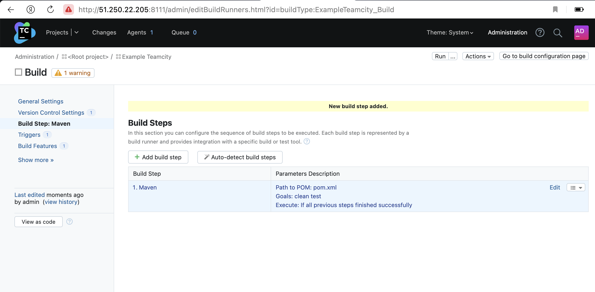
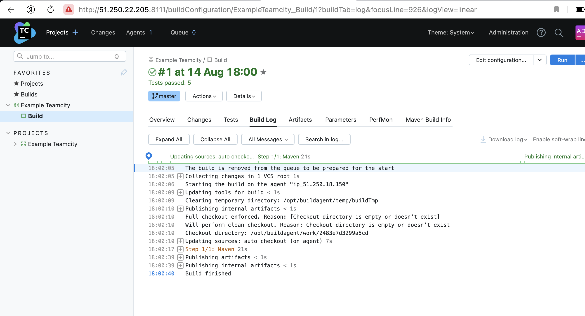
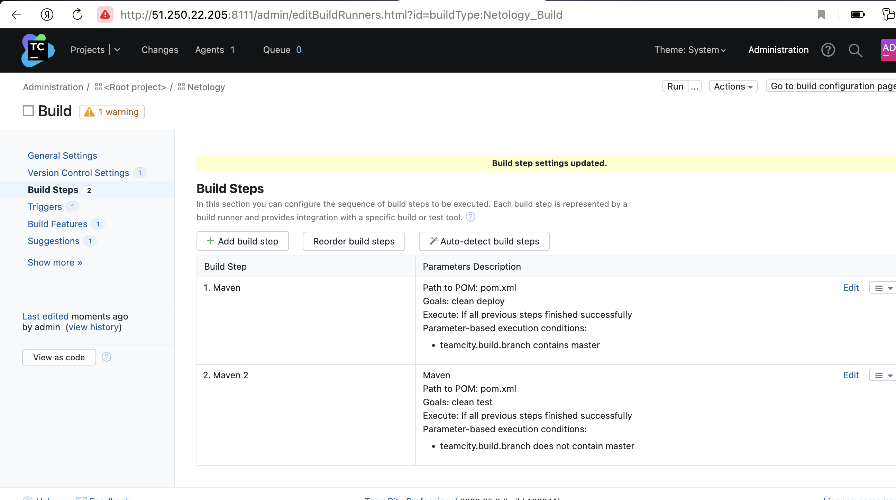
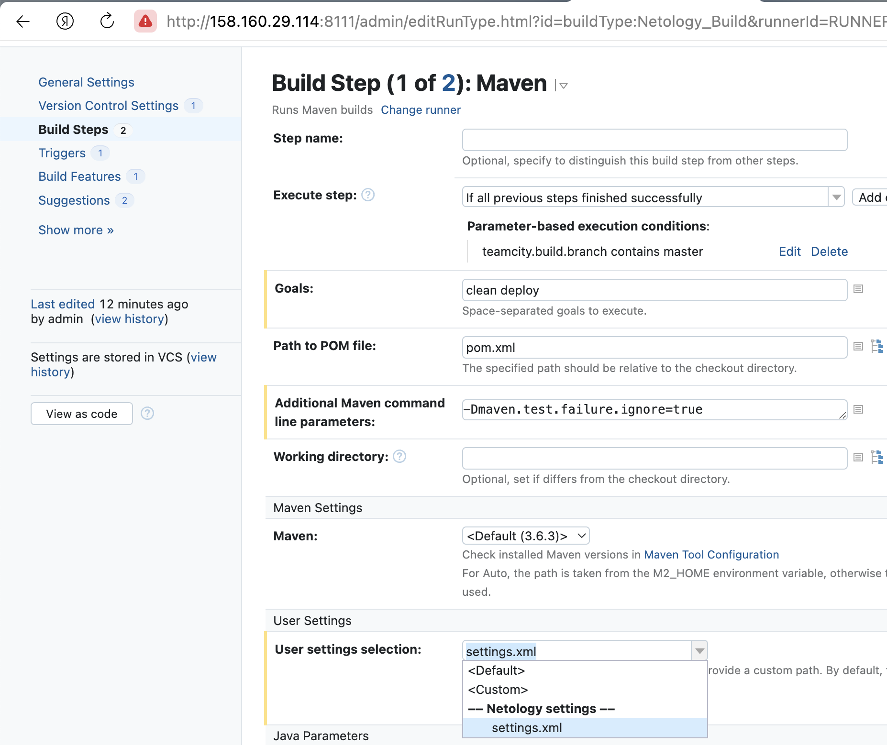
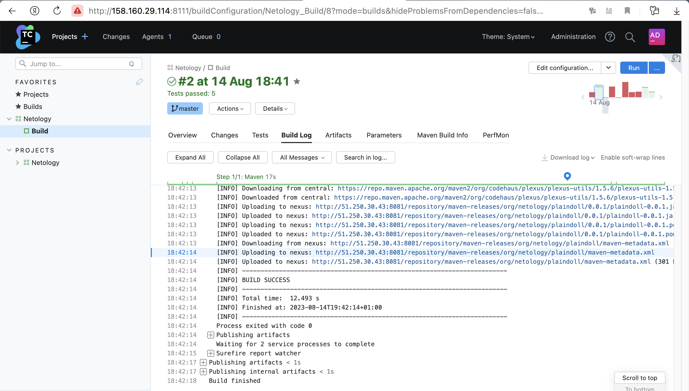
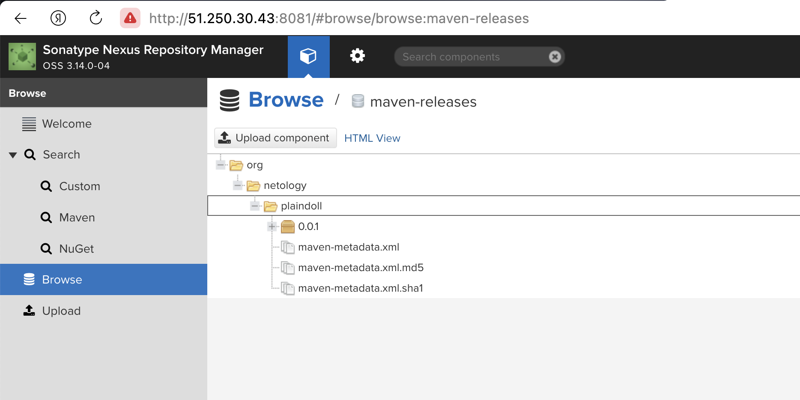
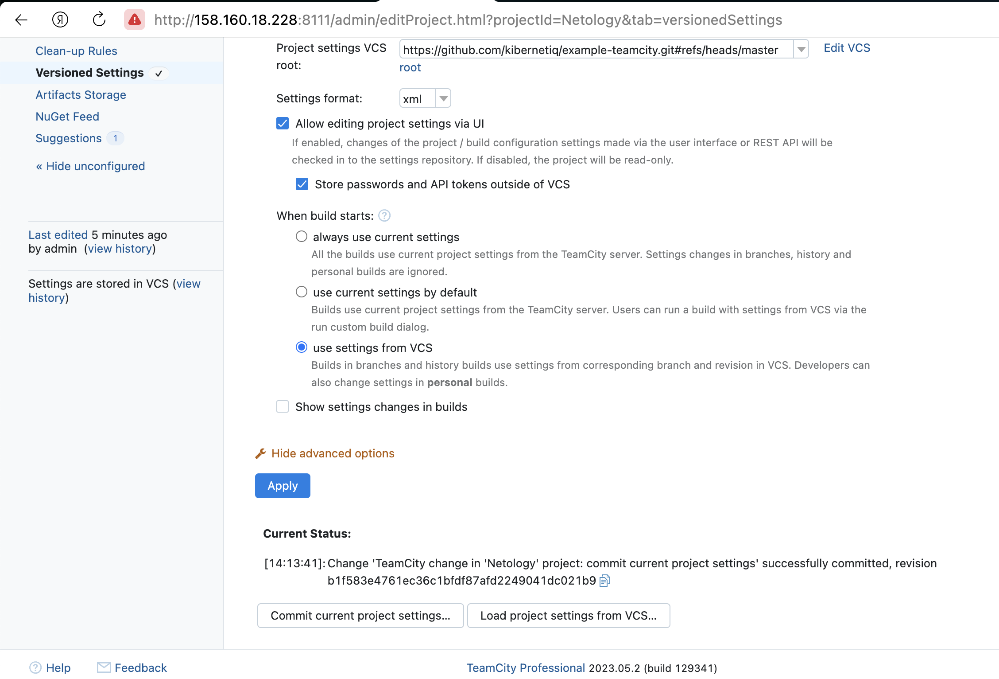
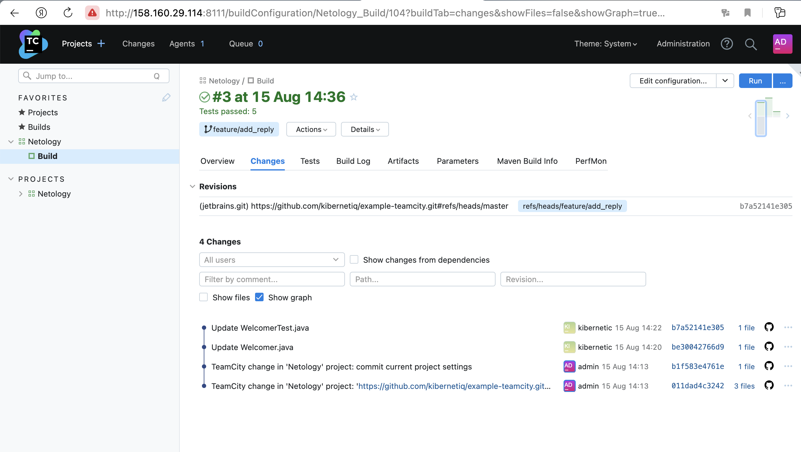
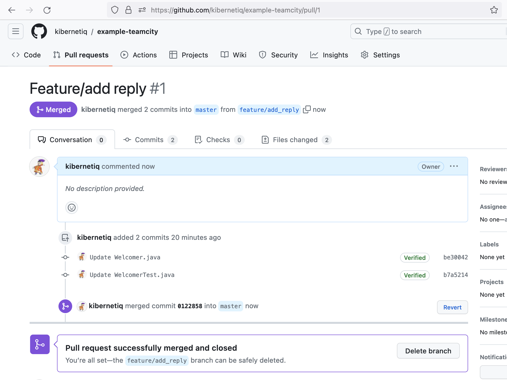
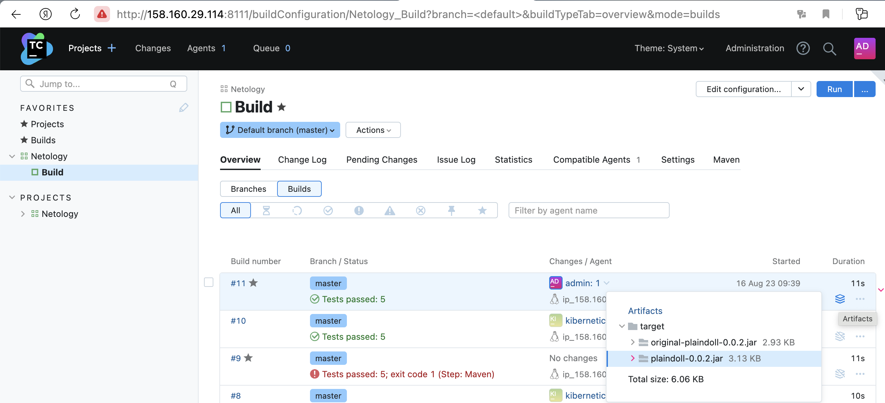

# Домашнее задание к занятию 11 «Teamcity»

1. Создайте новый проект в teamcity на основе fork.
2. Сделайте autodetect конфигурации.
3. Сохраните необходимые шаги, запустите первую сборку master.

  

  

4. Поменяйте условия сборки: если сборка по ветке `master`, то должен происходит `mvn clean deploy`, иначе `mvn clean test`.

  

5. Для deploy будет необходимо загрузить [settings.xml](./teamcity/settings.xml) в набор конфигураций maven у teamcity, предварительно записав туда креды для подключения к nexus.

  

6. В pom.xml необходимо поменять ссылки на репозиторий и nexus.
7. Запустите сборку по master, убедитесь, что всё прошло успешно и артефакт появился в nexus.

  

  

8. Мигрируйте `build configuration` в репозиторий.

  

9. Создайте отдельную ветку `feature/add_reply` в репозитории.
10. Напишите новый метод для класса Welcomer: метод должен возвращать произвольную реплику, содержащую слово `hunter`.  
[Коммит метода](https://github.com/kibernetiq/example-teamcity/pull/1/commits/be30042766d9181a6eb4d82cc181606c24a8f811)
11. Дополните тест для нового метода на поиск слова `hunter` в новой реплике.  
[Коммит теста](https://github.com/kibernetiq/example-teamcity/pull/1/commits/b7a52141e3056ec95621f4f0dedf3dbdf9a5e606)
12. Сделайте push всех изменений в новую ветку репозитория.
13. Убедитесь, что сборка самостоятельно запустилась, тесты прошли успешно.

  

14. Внесите изменения из произвольной ветки `feature/add_reply` в `master` через `Merge`.

  

15. Убедитесь, что нет собранного артефакта в сборке по ветке `master`.
16. Настройте конфигурацию так, чтобы она собирала `.jar` в артефакты сборки.

  

17. Проведите повторную сборку мастера, убедитесь, что сбора прошла успешно и артефакты собраны.
18. Проверьте, что конфигурация в репозитории содержит все настройки конфигурации из teamcity.  
19. В ответе пришлите ссылку на репозиторий.  
[Репозиторий конфигурации Teamcity](https://github.com/kibernetiq/example-teamcity/tree/master)